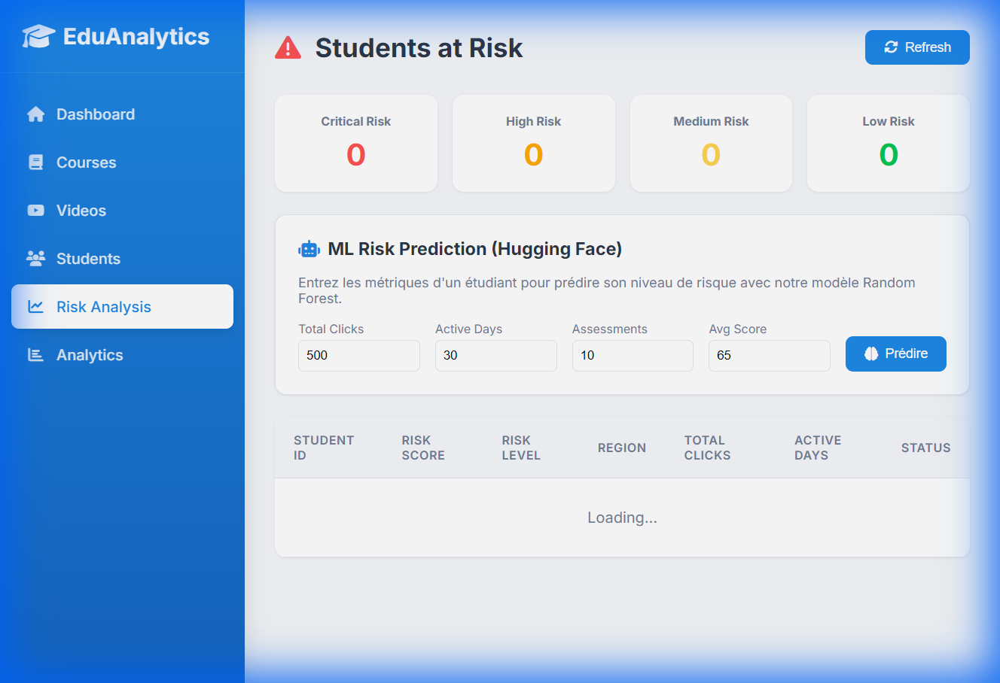
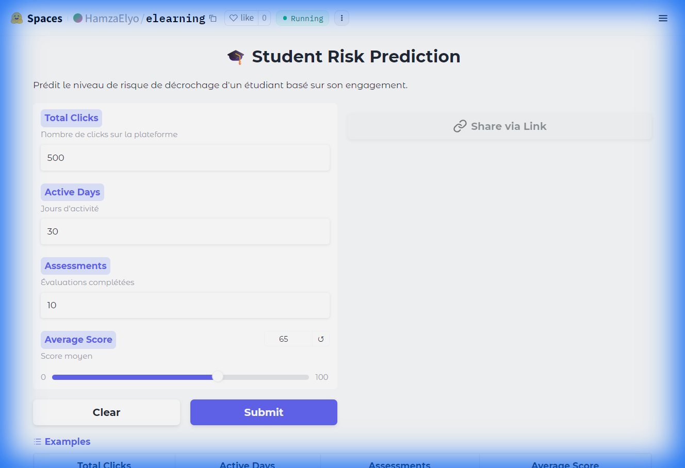

# 🎓 E-Learning Analytics Platform

Plateforme d'analytics e-learning avec Machine Learning pour la prédiction de risque de décrochage étudiant.

## 📸 Captures d'écran

### Dashboard Principal

*Vue d'ensemble avec statistiques globales des étudiants, cours et engagement*

### Gestion des Étudiants

*Liste des étudiants avec leurs métriques d'engagement et résultats*

### Analyse de Risque avec ML

*Prédiction de risque de décrochage avec intégration Hugging Face ML*

### Catalogue des Cours

*Vue des cours disponibles avec statistiques d'inscription*

### Hugging Face Space

*Interface Gradio du modèle ML déployé sur Hugging Face Spaces*

---

## 🏗️ Architecture

```
┌─────────────────────┐     ┌──────────────────────┐     ┌─────────────────┐
│  analytics-dashboard│     │   analytics-api      │     │   MongoDB       │
│  (JSP + CSS)        │────▶│   (JAX-RS REST)      │────▶│   (OULAD Data)  │
│  Port: 8080         │     │   Port: 8080         │     │   Port: 27017   │
└─────────────────────┘     └──────────────────────┘     └─────────────────┘
                                      │
                                      ▼
                            ┌──────────────────────┐
                            │  Hugging Face Spaces │
                            │  (Random Forest ML)  │
                            │  hamzaelyo-elearning │
                            └──────────────────────┘
```

---

## 🚀 Technologies

| Composant | Technologies |
|-----------|-------------|
| **Frontend** | JSP, CSS (MaterialPro Theme), JavaScript |
| **Backend API** | Jakarta EE 10, JAX-RS, CDI |
| **Base de données** | MongoDB (Dataset OULAD) |
| **Serveur** | WildFly 30 |
| **ML** | Python, Scikit-learn, Gradio, Hugging Face Spaces |

---

## 📦 Modules

### 1. analytics-dashboard
Dashboard web avec les pages:
- `/dashboard` - Vue d'ensemble
- `/dashboard/courses` - Catalogue des cours
- `/dashboard/students` - Liste des étudiants
- `/dashboard/predictions` - Analyse de risque ML
- `/dashboard/analytics` - Statistiques avancées

### 2. analytics-api
API REST avec les endpoints:
- `GET /api/v1/analytics/courses/top` - Top cours
- `GET /api/v1/analytics/students/global-stats` - Stats globales
- `GET /api/v1/analytics/predictions/at-risk` - Étudiants à risque
- `GET /api/v1/analytics/ml/predict` - Prédiction ML via Hugging Face

### 3. ml-model
Modèle ML déployé sur Hugging Face Spaces:
- `app.py` - Application Gradio
- Random Forest classifier
- URL: https://huggingface.co/spaces/HamzaElyo/elearning

---

## ⚙️ Installation

### Prérequis
- Java 17+
- Maven 3.8+
- WildFly 30+
- MongoDB 6+
- Dataset OULAD importé

### Déploiement

```bash
# 1. Compiler les modules
cd analytics-api
mvn clean package -DskipTests

cd ../analytics-dashboard
mvn clean package -DskipTests

# 2. Déployer sur WildFly
cp analytics-api/target/analytics-api.war $WILDFLY_HOME/standalone/deployments/
cp analytics-dashboard/target/analytics-dashboard.war $WILDFLY_HOME/standalone/deployments/

# 3. Démarrer WildFly
$WILDFLY_HOME/bin/standalone.bat
```

### Accès
- Dashboard: http://localhost:8080/analytics-dashboard/dashboard
- API: http://localhost:8080/analytics-api/api/v1/analytics

---

## 🤖 Intégration Machine Learning

Le widget ML Prediction utilise un modèle Random Forest hébergé sur Hugging Face:

1. **Entrée**: Clicks, Jours actifs, Évaluations, Score moyen
2. **Traitement**: Java API → Hugging Face Gradio → Random Forest
3. **Sortie**: Niveau de risque (Critical/High/Medium/Low) + Score (0-100%)

---

## 📊 Dataset OULAD

Open University Learning Analytics Dataset:
- ~32,000 étudiants
- ~10 millions d'events
- Cours, évaluations, clicks VLE

---

## � Auteur

**HamzaElyo** - Projet JEE S9 UEMF

---

## 📄 License

MIT License
